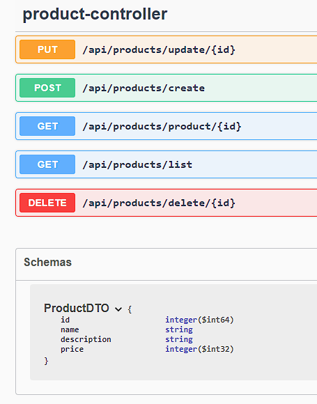
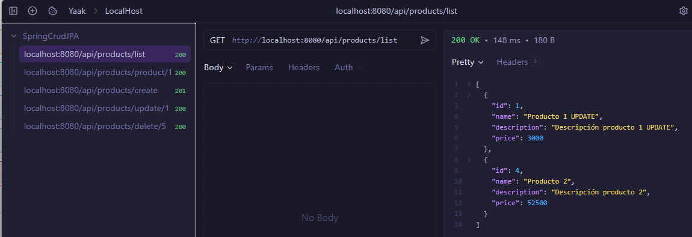
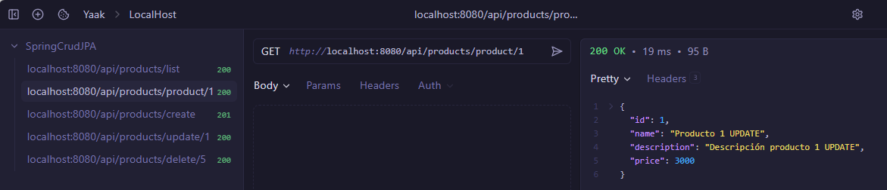
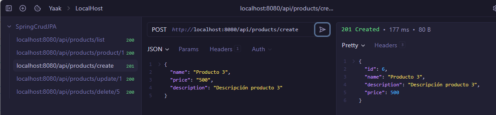
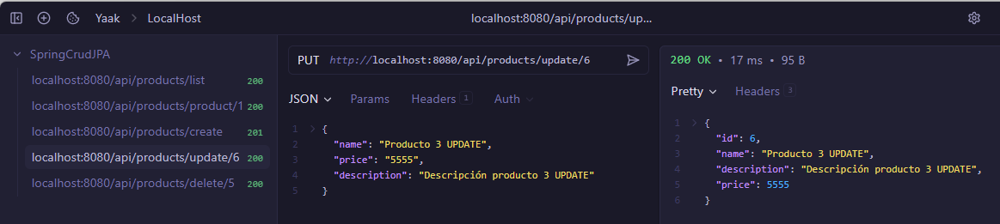
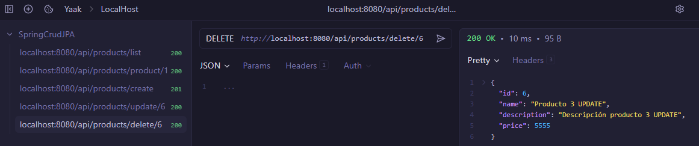

# PROYECTO API - BACKEND CON SPRING

Una práctica habitual en el backend es crear APIS.
En este caso creamos una API con Spring usando **Modelo Vista Controlador** aunque no tenga vista definida ya que solo nos interesa el backend.

## Pasos para la creación de la API

1. Configuramos el archivo ***application.properties***
2. Creamos los paquetes para los controladores, entidades, repositorios y servicios.
3. Creamos las clases modelo, en este caso Product.
4. Creamos el Repository que extenderá de CrudRepository
5. Creamos las clases Service, primero la interface del product con sus métodos
6. También en service creamos la implementación de la interfaz anterior donde daremos forma a los métodos.
7. Creamos unos tests básicos para comprobar los métodos de la implementación
8. Creamos el controlador para desarrollar la lógica de los métodos CRUD
9. Creamos los tests del controlador para no olvidarnos de las buenas prácticas
10. Finalmente, usaremos un DTO para no usar directamente el objeto entity por lo que modificamos las clases para reflejar esos cambios.

## Swagger UI

Podemos usar la dependencia springdoc para ver la documentacion de la API via web añadiendo **/swagger-ui.html** a la URL.

Por ejemplo, en el caso de usar la app en local la ruta http://localhost:8080/swagger-ui.html

## Rutas API

- GET listar productos: 

    **/api/products/list**

- GET listar producto por id: 

    **/api/products/product/{id}**

- POST crear producto:

    **/api/products/create**

- PUT modificar poducto: 

    **/api/products/update/{id}**

- DELETE borrar producto por id: 

    **/api/products/delete/{id}**

